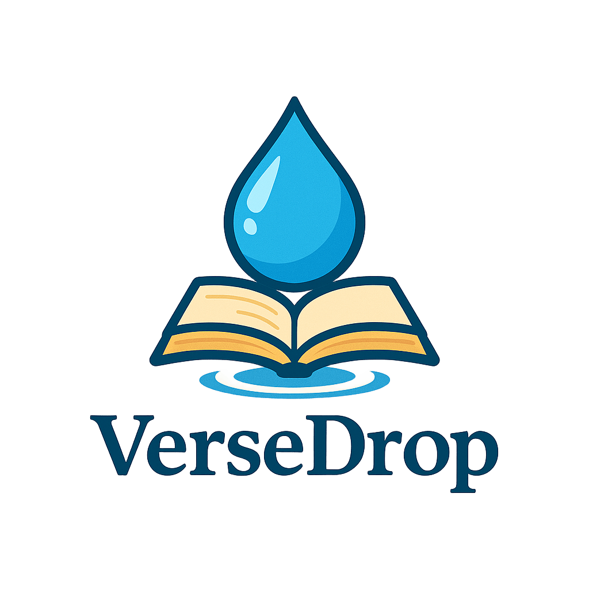

# VerseDrop 🌧️

**VerseDrop** é um aplicativo web simples que exibe versículos bíblicos aleatórios. A proposta é ser como uma gota refrescante da Palavra de Deus no seu dia — algo leve, bonito e inspirador.



---

## Funcionalidades

✅ Exibe um versículo aleatório da Bíblia (em inglês)

📱 Design leve e responsivo com tema azul (água/gota)

💧 Animação de uma gota caindo e som suave de água

🔁 Botão para exibir outro versículo

📖 Link externo para ler a Bíblia completa

🧼 Código limpo e organizado (HTML, CSS, JS e Python com Flask)

---

## Pré-requisitos

🐍 Python 3.8 + 

📦 Pip

---

## Instalação🚀

Clone o repositório:

```bash
git clone https://github.com/seu-usuario/versedrop.git
cd versedrop
```

## Instale as dependências:

```bash
pip install flask
```

## Como executar ▶️
No terminal, dentro da pasta do projeto:

```bash
python app.py
```
Acesse no navegador:
```bash
http://localhost:5000
```

## Estruturação das pastas📁
```bash
versedrop/
│
│ quote(ambiente virtual)
│   
├── data/
│   └── verses.json
│
├── static/
│   ├── imagens/
│   │   └── logo_versedrop1a.png
│   │   └── logo_versedrop2a.png
│   ├─ sounds/
│       └── water-drop.mp3
│   ├── script.js
│   ├── style.css
│
├── templates/
│   └── index.html
│
├── app.py
│
├── controllers.py
│
├── README.md.
│
└── requirements.txt
```

## Inspiração 📖
"My teaching will drop as the rain, my speech shall distill as the dew..."
— Deuteronomy 32:2


## Contribuição🤝
Pull requests são bem-vindos! Se quiser sugerir novos versículos ou melhorias, fique à vontade.

## Feito com carinho por Matheus Lopes 💧📖❤️


---
